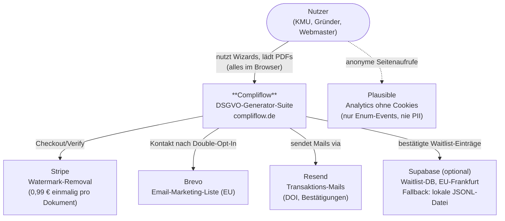
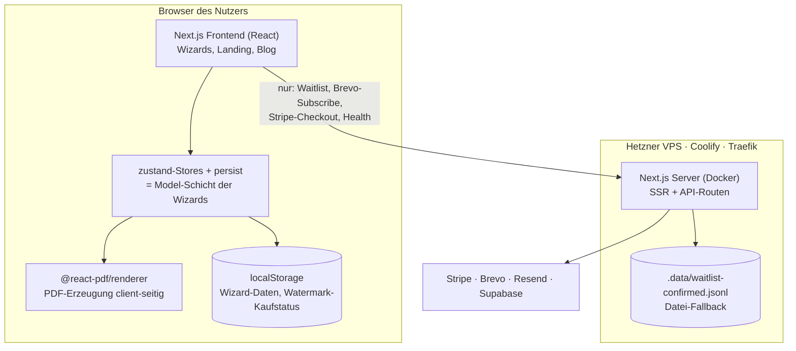

# Compliflow — Architektur

> Dokumentiert nach dem **C4-Modell** (Context → Container → Component), wie in
> SE-Vorlesung 6 (Graziotin) empfohlen. Level 3+4 bewusst nur als Text — die
> Vorlesung selbst rät von gepflegten Detail-Diagrammen ab ("generally not
> recommended", besser on-demand aus dem Code lesen).
>
> Zweck: Das System existiert nicht nur "im Kopf" — dieses Dokument ist die
> Landkarte. Bei Architektur-Änderungen (neuer externer Dienst, neue
> Persistenz, neues Tool) dieses Dokument mit-aktualisieren.

---

## 1. Architektur-Entscheidungen (das "Warum")

Die Vorlesung sagt: Nicht-funktionale Anforderungen (NFRs) formen die
Architektur. Bei Compliflow war die dominante NFR **Datenschutz** — wir bauen
ein DSGVO-Tool, also darf das Tool selbst keine Datenkrake sein.

| Entscheidung | Getrieben von (NFR) | Konsequenz |
|---|---|---|
| Wizard-Daten bleiben im Browser (localStorage, zustand persist) | Datenschutz/Privacy | Kein Server sieht je Formularinhalte. Kein Account-System nötig. |
| PDF-Generierung client-seitig (@react-pdf/renderer) | Datenschutz + Kosten | Dokumente entstehen im Browser des Nutzers, verlassen ihn nie. |
| Ein Monolith (eine Next.js-App), keine Microservices | Wartbarkeit (Solo-Dev) + Kosten | Ein Deploy, ein Log, ein Repo. Microservices wären hier reine Komplexität ohne Nutzen (siehe Vorlesung 8: Microservices lösen Team-Skalierungsprobleme, die es solo nicht gibt). |
| Server nur für: Waitlist/DOI, Brevo, Stripe, Health | Notwendigkeit | Nur was zwingend ein Geheimnis braucht (API-Keys, HMAC-Secret) läuft serverseitig. |
| Docker + Coolify auf Hetzner statt Vercel | Kosten + EU-Hosting | Volle Kontrolle, EU-Server, Fixkosten. |

## 2. Level 1 — System-Kontext (Wer redet mit wem?)

Compliflow als Blackbox mit allen Menschen und Fremdsystemen drumherum.



**Wichtigste Eigenschaft:** Der Pfeil "Nutzer → Compliflow" transportiert bei
den Generatoren **keine Daten zum Server**. Wizard-Inhalte existieren nur im
Browser (Release-Audit-Regel 1).

## 3. Level 2 — Container (Was läuft wo?)

"Container" = eigenständig laufende Einheit (nicht Docker-Container gemeint,
auch wenn es hier zufällig einer ist).



**API-Oberfläche (vollständig):** `app/api/` enthält genau diese Routen —
`waitlist/confirm`, `brevo/subscribe`, `stripe/{checkout,verify-session,webhook}`,
`health` — plus Server Action `app/actions/waitlist.ts`. Jede public Route:
Zod-Validierung + Rate-Limit (`lib/rate-limit.ts`) VOR jedem Seiteneffekt
(Release-Audit-Regel 2).

## 4. Level 3 — Komponenten-Muster (Wie ist der Code organisiert?)

Compliflow folgt **Vertical Slices**: Jedes Tool ist ein vollständiger
vertikaler Schnitt durch alle Schichten, immer nach demselben Schema.

```
app/<tool>/page.tsx            Route (Einstieg)
components/<tool>/
  wizard-shell.tsx             Controller: Schritt-Navigation, Validierungs-Gate
  steps/                       View: die einzelnen Formular-Schritte
  pdf-download.tsx             Export-Gate (gesperrt bis Pflichtfelder komplett)
lib/<tool>/
  types.ts                     Datenmodell
  store.ts                     Model: zustand-Store mit persist → localStorage
  defaults.ts                  Vorbelegungen
  contract.ts                  Dokument-/Vertragslogik (Textbausteine)
  pdf/                         PDF-Layout (nur bei Tools mit PDF-Export)
  *.test.ts                    Tests liegen neben dem Code
```

Das ist MVC aus der Vorlesung, übersetzt in React-Begriffe:
**Model** = `lib/<tool>/store.ts` · **View** = `components/<tool>/steps/` ·
**Controller** = `wizard-shell.tsx`.

Tool-übergreifend geteilt (Schicht "Shared Services"):
`lib/{env,rate-limit,doi-token,email,brevo,utils}.ts` und
`components/{legal,email-capture,watermark,brand}/`.

### Rezept: Tool Nr. 8 hinzufügen

1. `lib/<neues-tool>/` anlegen: `types.ts` → `defaults.ts` → `store.ts` → `contract.ts` (+ Tests)
2. `components/<neues-tool>/`: `wizard-shell.tsx` von einem bestehenden Tool kopieren, `steps/` bauen
3. `app/<neues-tool>/page.tsx` + Eintrag in `lib/tools.ts`
4. Pflicht (Release-Audit-Regel 5): Rechtsberatungs-Disclaimer + `getCompletionStatus`-Export-Sperre + Platzhalter-Check

## 5. Bekannte, bewusste Abweichungen (Technical Debt)

| Abweichung | Verletztes Prinzip | Status |
|---|---|---|
| 7 fast identische `wizard-shell.tsx` (je ~250 Zeilen) statt einer gemeinsamen Wizard-Engine | "Implement Once" (Vorlesung 6) | **Bewusst zurückgestellt.** Refactoring erst, wenn der nächste Generator gebaut wird (Premium-Tools Monat 4–7). Bis dahin: Bugfix im Wizard-Verhalten muss in allen 7 Shells nachgezogen werden. |
| `components/wizard/` enthält nur Typografie, keine Engine | Namensgebung irreführend | Wird beim Wizard-Refactoring zur echten Engine. |

## 6. Datenflüsse (die drei einzigen Wege, auf denen Daten fließen)

1. **Generator-Nutzung:** Eingaben → zustand-Store → localStorage → PDF im Browser. Verlässt den Browser nie.
2. **Waitlist/Email:** Email-Adresse → Server Action → DOI-Mail via Resend → Klick auf HMAC-Token-Link → Supabase (oder JSONL-Fallback) → optional Brevo-Liste.
3. **Zahlung (aktiv — Watermark-Removal 0,99 €):** Stripe Checkout → Redirect zurück → Session-ID in localStorage → `verify-session` prüft bei jedem Load gegen Stripe.
